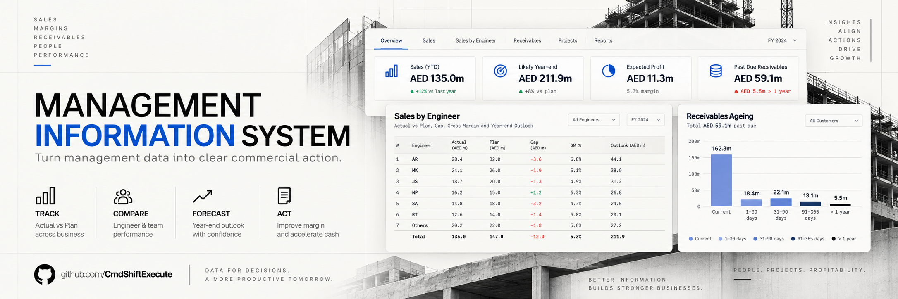
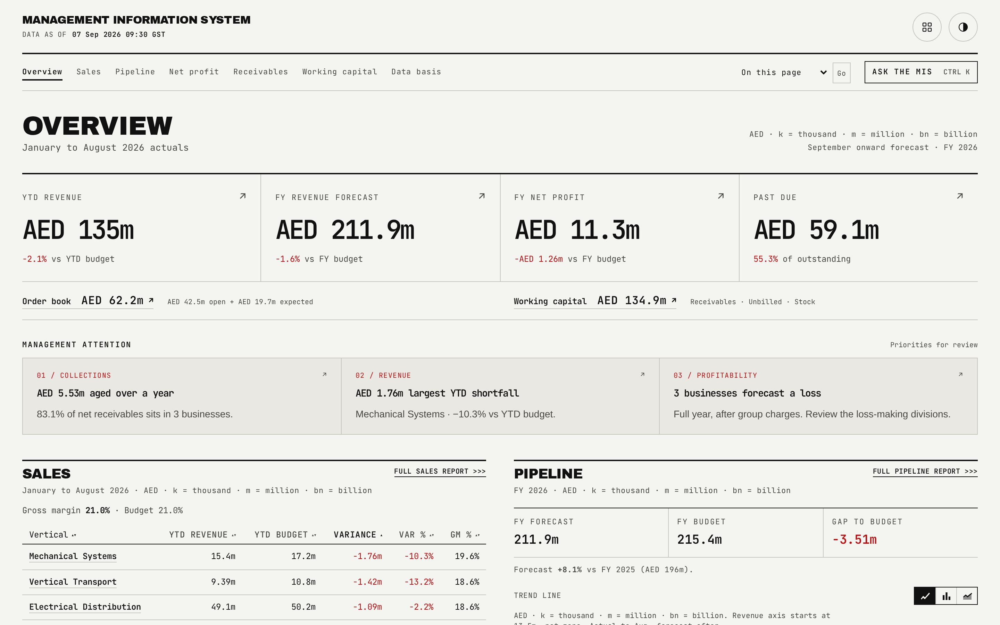

# Management Information System

*A zero-backend management information system for a fictional, unnamed multi-divisional engineering group, built to answer five questions a division head asks every month.*

## What it is

This Management Information System is built for a fictional, unnamed multi-divisional engineering group. It answers the five questions a division head asks in order: how is sales performing against plan, what revenue will be delivered this year, what profit is expected after costs, which businesses explain the gaps, and where is working capital tied up. Every figure on the page states its measure, its period and its comparator, so nothing appears as a bare number a reader has to interpret from context.

The whole application turns on one design rule: nothing is computed in the browser. It is a static Vite and React site sitting on top of finished JSON tables written by a generator, and every table, chart and headline figure is a sort, a filter or a format of data that already exists on disk. If a number on screen is wrong, the fix belongs in the generator, never in a component. All data is synthetic, generated from one seed. No real company, person or figure appears anywhere in this repository.

## Live demo

**https://kinetics-mis-demo.vercel.app/**

## Highlights

- Multi-vertical (electrical distribution, cooling, mechanical systems, pumps and water, vertical transport, metering, automation, fabrication, trading and services), each with its own full sheet of sales, profit, targets, inventory, unbilled work and receivables.
- 527 of 527 reconciliation assertions pass, checked independently of the generator by re-reading the written JSON and asserting every figure published in more than one place ties exactly.
- 165 browser interaction checks (Playwright, against a served build) cover page structure, keyboard traversal, chart behaviour and error resilience, including negative controls that prove each check can actually fail.
- Three named themes, Parchment, Light and Dark, measured across 75 contrast pairs by a gate that reads the color tokens directly out of the stylesheet, so the palette cannot silently drift out of WCAG compliance.
- Ten charts, and every one carries a view switch offering two or three readings of the same data, remembered per chart across a reload.
- Ask the MIS, a grounded question-answering panel, is checked by a 33-question regression suite (19 roll-up questions plus vertical, engineer, unanswerable and derived cases) at a pass threshold of 31 of 33.
- Every money value is an integer in AED thousands, rounded exactly once at the lowest level the generator produces, so every higher total in every table ties with no display rounding.
- Distinct, readable states for loading, missing data, malformed data and an invalid route, so a reader or an automated check can always tell which condition it is looking at.

## Pages

| Page | What it shows | Guide |
|---|---|---|
| Overview (`/`) | Four headline figures, order book and working capital, and a management attention band naming the three things to act on first | [docs/01-overview.md](docs/01-overview.md) |
| Sales (`/sales`) | Full sales performance by vertical and by engineer, plus the complete netting disclosure | [docs/02-sales.md](docs/02-sales.md) |
| Pipeline (`/pipeline`) | Revenue forecast and pipeline by vertical for the full year, plus the division's monthly revenue run | [docs/03-pipeline.md](docs/03-pipeline.md) |
| Net profit (`/net-profit`) | The profit and loss ladder from revenue to BU-level net profit, plus vertical profitability ranked worst first | [docs/04-net-profit.md](docs/04-net-profit.md) |
| Receivables (`/receivables`) | Net to collect, past due, aging, and why each balance has not been collected | [docs/05-receivables.md](docs/05-receivables.md) |
| Working capital (`/working-capital`) | Receivables, unbilled work and inventory tied up, by vertical | [docs/06-working-capital.md](docs/06-working-capital.md) |
| Vertical detail (`/v/:slug`) | One vertical's full sheet: sales by engineer, profit and loss, targets, inventory, unbilled projects and receivables | [docs/07-vertical-detail.md](docs/07-vertical-detail.md) |
| Customer aging (`/v/:slug/receivables`) | The full customer-level aging table behind a vertical's receivables summary | [docs/08-customer-aging.md](docs/08-customer-aging.md) |
| Engineer (`/v/:slug/e/:eng`) | One sales engineer's own book: product lines, targets, unbilled projects and the customers who owe them | [docs/09-engineer.md](docs/09-engineer.md) |
| Data basis (`/data-basis`) | Sources, definitions, the precision policy, and the reconciliation result | [docs/10-data-basis.md](docs/10-data-basis.md) |

Ask the MIS, the grounded question-answering panel available from every page, is documented separately: [docs/ASK_THE_MIS.md](docs/ASK_THE_MIS.md). Two more references: [docs/COVERAGE_MAP.md](docs/COVERAGE_MAP.md) maps every field of the reference MIS workbook this demo is modelled on to where it lives here, and [docs/mis-refinement-plan.md](docs/mis-refinement-plan.md) records the design rationale behind the navigation and theming refinement.

## The data behind it

Every figure comes from one generator, `scripts/generate_demo_data.ts`, run from one seed, writing `public/data/rollup.json`, `index.json`, one file per vertical and one file per engineer. The generator encodes the business rules by itself: the netting rule that counts a shared product line once, in its home vertical; the precision policy that rounds each money value exactly once at the leaf and sums integers above it, so nothing above the leaf carries independent rounding; the receivables due-date model that separates past due from aging bucket and derives a single reason per balance; the unbilled month bridge that must reconcile exactly or the generator refuses to write output; and the inventory age bands and provision rule.

`bun run reconcile` re-reads the written JSON files, independently of the generator's own in-memory checks, and writes `public/data/reconciliation.json`. Its 527 assertions are organised in three tiers, division level, vertical level and per-row (every customer's aging buckets, every unbilled project's age bands), so the count grows with the size of the dataset rather than staying fixed. The reconcile script is idempotent: run again against an unchanged dataset, it reports the result unchanged and does not rewrite the file, so it can run as a genuine verification step without ever dirtying a clean working tree. Full detail: [docs/data-model.md](docs/data-model.md).

## Quality gates

| Command | What it proves |
|---|---|
| `bun run data` | Runs the generator and writes every JSON file under `public/data/`. |
| `bun run reconcile` | Re-reads the written files and asserts every cross-table equality: 527 of 527 assertions pass. |
| `bun run typecheck` | The TypeScript compiler in strict mode, project-wide, with no emitted output. |
| `bun run lint` | oxlint across the source. |
| `bun run contrast` | Reads the color tokens directly out of `src/styles/index.css` across all three themes and fails if any text pair falls under a 4.5 to 1 ratio or any non-text mark falls under 3 to 1: 75 pairs measured. |
| `bun run interactions --base <origin>` | Drives a real, served build with Playwright: structure, sort and keyboard behaviour, chart interaction with negative controls, cross-page redirects, and error resilience: 165 checks. |
| `bun run motion` | Refuses a scroll-triggered animation on anything but the shared reveal component, so a chart mark can never deadlock invisible on an element whose entry state collapses its own bounding box. |
| `bun run ask:test` | Unit tests for the grounding module behind Ask the MIS: context selection, the token cap, page resolution, the citation check and the figure audit. |
| `bun run ask:regression --base <origin>` | Drives the live answer service with 33 real questions and checks every reply against the published data itself, never a stored expectation. Passes at 31 of 33 or better. |
| `bun run screenshots` | Captures every route at desktop, laptop and phone widths with a real Chromium and fails on any console error. |
| `bun run check` | Chains `data`, `reconcile`, `typecheck`, `lint`, `motion`, `ask:test`, `build` and `contrast` in order. |

Full detail on every check, including the negative controls: [docs/quality-gates.md](docs/quality-gates.md).

## Design system

The interface is Swiss Industrial Print: a rigid, ruled, print-shop-catalogue layout on a light paper substrate, with zero border radius anywhere except the two circular masthead menus, which beat the reset with an equally explicit, deliberately named exception. Two typefaces, both self-hosted so the app has no external font-loading dependency: a condensed black display face for headings, and a monospaced face for every paragraph, label and numeral, so every column of figures aligns on its digit grid. A single hazard-red accent is earned, never decorative, appearing only for a negative variance, an overdue balance or a failed check; a second print ink drives the four report charts' primary series.

Three named themes, Parchment, Light and Dark, are chosen before first paint by an inline script so the page never flashes the wrong palette, persist per origin in local storage, and fail safely to Parchment if storage throws. Ten charts each carry a view switch, a segmented control offering two or three readings of the same data, remembered per chart. Motion follows five patterns: page and headline figures rise once on load, sections and rows reveal on scroll, charts draw themselves in with a genuine path animation rather than a CSS transition, hover and press feedback use a shared tactile press class, and every one of these checks `prefers-reduced-motion` and renders at rest with no transform when it is set. Full detail: [docs/design-system.md](docs/design-system.md).

## Run it locally

1. `bun install` installs dependencies.
2. `bun run data` runs the generator and writes the JSON tables under `public/data/`.
3. `bun run check` runs the full gate chain: data, reconcile, typecheck, lint, motion, the Ask unit tests, the production build and contrast.
4. `bun run dev` starts the Vite dev server, or `bun run preview` serves the production build at `127.0.0.1:4180`.
5. `bun run ask` starts the Ask the MIS answer service on its own socket, separately, if you want the question panel to answer for real; `bun run preview` proxies `/api/ask` to it the same way the live site does. Without this running, the panel still renders, it simply cannot produce an answer.

## Sibling demos

- **Project Intelligence System**: a scored market register and relevance matrix across thousands of synthetic projects. [github.com/CmdShiftExecute/kinetics-bnc-demo](https://github.com/CmdShiftExecute/kinetics-bnc-demo) · [live demo](https://kinetics-pis-demo.vercel.app/)
- **Warehouse Information System**: a warehouse management demo sharing this app's design system and component patterns. [github.com/CmdShiftExecute/kinetics-wms-demo](https://github.com/CmdShiftExecute/kinetics-wms-demo) · [live demo](https://kinetics-wms-demo.vercel.app/)

---

Synthetic demo. No real company, person or figure.
