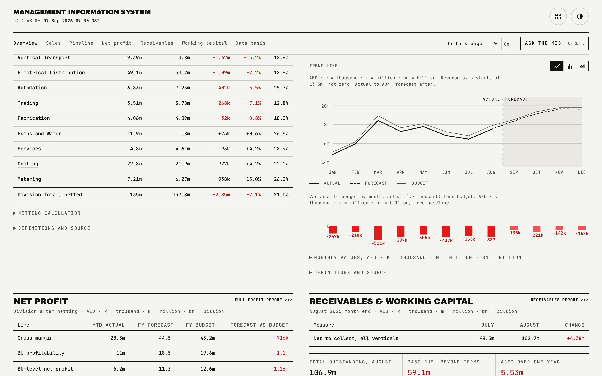

# Overview

The front page. It answers five questions in a fixed order: how is sales performing against plan, what revenue will be delivered this year, what profit is expected after costs, which businesses explain the gaps, and where is working capital tied up. Every figure names its measure, its period and its comparator in the surrounding prose, so nothing reads as a bare number.

## What is on the page

- **Headline band**, four figures in a fixed order: YTD revenue against YTD budget, full-year revenue forecast against full-year budget, full-year net profit against budget, and past due as a share of outstanding. A card turns red only when the figure is below budget or, for past due, always, because past due is by definition beyond terms.
- **Secondary band**: order book (open plus expected orders, with the split spelled out because expected orders are not secured business) and total working capital, neither ever coloured because neither carries a budget or a term to be beyond.
- **Management attention band**: three numbered priorities, each linking to its own evidence: the amount aged over a year and where it concentrates, the largest revenue shortfall by business, and how many businesses forecast a full-year loss.
- **Sales section**: a sentence on YTD revenue against budget, then a sortable table of every vertical (default sort: largest shortfall first), and a netting disclosure explaining how a shared product line is counted once.
- **Pipeline section**: three figures (forecast, budget, forecast less budget) and the division's monthly revenue chart.
- **Net profit section**: a three-row table (gross margin, BU profitability, BU-level net profit), each showing YTD actual, forecast and budget, plus a note on any loss-making businesses.
- **Receivables and working capital section**: net to collect this month against last month, three summary figures, the businesses holding the largest receivables concentration, and a labelled row of four working-capital figures.

## How the figures are built

Every figure on this page is read directly from `rollup.json`, the one generator output every other report also reads. The only arithmetic performed on the page itself is the order-book sum of two already-published fields, so the headline band can never disagree with the detailed tables below it. The red/not-red rule reuses the same variance-below-budget logic used everywhere else in the app rather than a threshold invented for this page.

## Interactions

The sales table sorts on any column by clicking its header (defaulting to variance, ascending, so the largest shortfall leads). Rows fade in with a staggered scroll reveal. The netting calculation opens as a keyboard-accessible disclosure. The headline and management-attention bands each link into the section or report page that carries their detail.

## See also

- [README](../README.md) for the full page index and the live demo.
- [docs/02-sales.md](02-sales.md) for the full sales table this page summarises.
- [docs/04-net-profit.md](04-net-profit.md) for the full profit and loss ladder.
- [docs/05-receivables.md](05-receivables.md) and [docs/06-working-capital.md](06-working-capital.md) for the receivables and working-capital detail.
