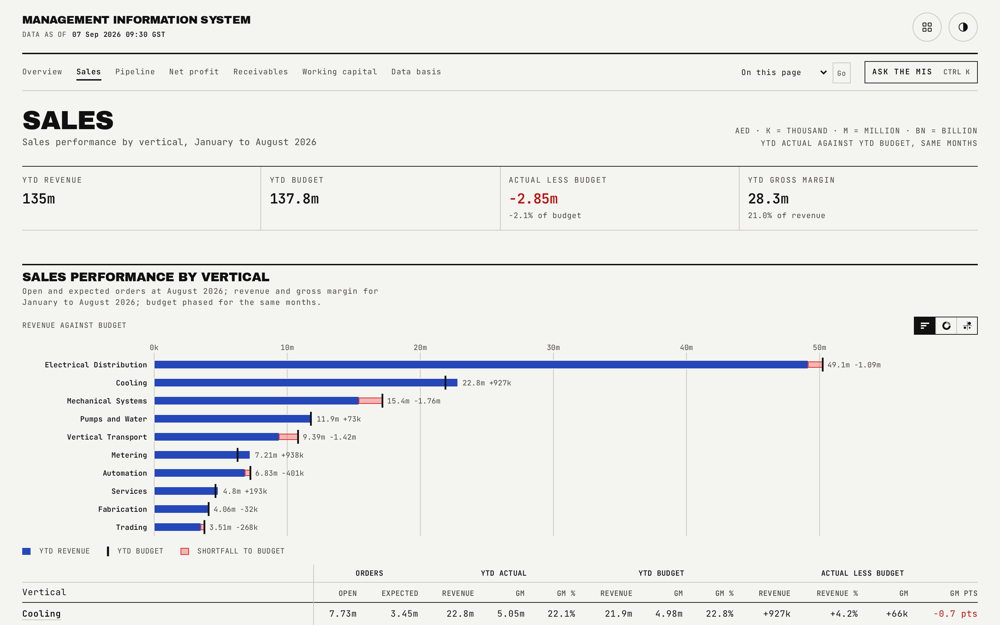

# Sales

The full sales performance report by vertical and by engineer, plus the complete netting disclosure: every shared product line individually, not just the summary sentence shown on the Overview.

## What is on the page

- **Sales performance by vertical**: a two-tier header table with column groups for orders (open, expected), YTD actual (revenue, gross margin, gross margin percent), YTD budget, and actual less budget. Rows list every vertical except the largest, then a subtotal-excluding-largest row, the largest vertical's own row, and a total row.
- **Sales by engineer**: for every vertical, a vertical summary row followed by one row per engineer, each linking to that engineer's own page, showing YTD revenue, budget, variance, gross margin percent, and full-year forecast against budget.
- **Netting**: prose stating the gross, double-counted and netted YTD and full-year figures, then a table listing every shared product line: the engineer who sells it, the vertical it is counted in (its home vertical), the vertical it also appears on, YTD revenue and full-year forecast. A closing total row shows what double counting would look like if the sheets were simply summed.

## How the figures are built

The netting rule is the generator's own: a shared product line (fabricated ductwork and fabricated pipe supports, sold by Cooling and Mechanical Systems engineers but also belonging to the Fabrication vertical's own sheet) counts once, in its home vertical. Every vertical file carries a sheet total, covering every row shown on that sheet, and an attributed total, covering that vertical's own engineers only; division summaries always use the attributed figures. The largest vertical is always broken out separately from the "others" subtotal, a convention held across every report on this site.

## Interactions

This page has no sort control (the row order is the generator's own, with the largest vertical always shown separately); the netting section opens as a keyboard-accessible disclosure.

## See also

- [README](../README.md) for the full page index.
- [docs/01-overview.md](01-overview.md) for the summarised version of this table.
- [docs/09-engineer.md](09-engineer.md) for a single engineer's own book.
- [docs/10-data-basis.md](10-data-basis.md) for the netting rule stated as policy.
