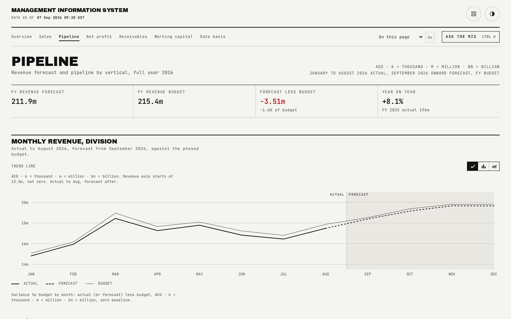

# Pipeline

Revenue forecast and pipeline by vertical for the full fiscal year, plus the division's monthly revenue run.

## What is on the page

- A four-figure strip: full-year revenue forecast, full-year revenue budget, forecast less budget (signed), and year-on-year percent (signed, with prior-year actual named beside it).
- **Monthly revenue, division**: the monthly revenue chart for the whole division.
- **Revenue forecast and pipeline by vertical**: a table with columns for prior-year actual, YTD actual, near-month forecast, rest-of-year forecast, full-year forecast, full-year budget, forecast less budget, forecast-versus-budget percent, and year-on-year percent, in the same others/subtotal/largest/total row pattern used on the sales table.

## How the figures are built

The near-month and rest-of-year labels are derived from how many months of the fiscal year have elapsed: the near month is the first unelapsed month, and the rest-of-year label spans everything after it through December. Every figure is read from `rollup.json`; nothing on this page is computed independently of the generator.

## Interactions

The monthly revenue chart draws itself in on load (a genuine path animation, not a CSS transition) and carries a view switch offering more than one reading of the same monthly series; it answers a plain pointer move or an arrow-key press with a crosshair readout, and the underlying month-by-month table is available as a keyboard-accessible disclosure beneath it.

## See also

- [README](../README.md) for the full page index.
- [docs/01-overview.md](01-overview.md) for the summarised pipeline figures.
- [docs/07-vertical-detail.md](07-vertical-detail.md) for one vertical's own forecast detail.
