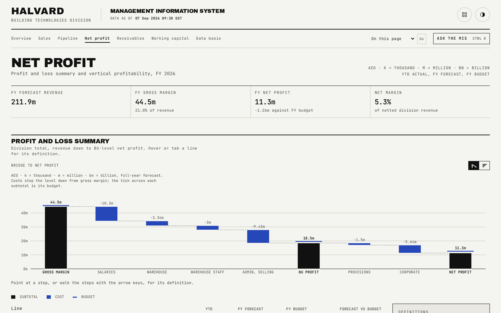
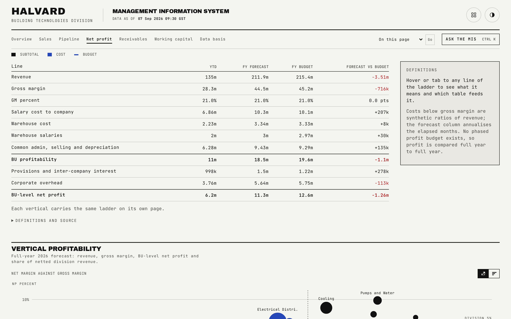

# Net profit

The full profit and loss ladder from revenue down to BU-level net profit, plus a per-vertical profitability ranking.

## What is on the page

- **Profit and loss summary**: the division-total profit and loss ladder, YTD actual, full-year forecast, full-year budget and forecast-versus-budget, from revenue down through gross margin, BU profitability and BU-level net profit. Each rung on the ladder opens its own definition, naming which table feeds it.
- **Vertical profitability**: a table (full-year forecast revenue, gross margin, net profit, gross margin percent, net profit percent, revenue share) sorted ascending by net profit, worst first, for every vertical except the largest, then subtotal, largest and total rows. Prose below names every vertical forecasting a loss.

## How the figures are built

Profit is compared full year to full year, never year-to-date to a phased budget, because no approved profit budget exists for the elapsed months; this is why no year-to-date profit-attainment figure appears anywhere on this page. The ladder shown here renders the division-total column group only. The underlying data still carries three column groups, excluding the largest vertical, the largest vertical alone, and the division total, and `bun run reconcile` publishes assertions proving the first two sum to the third on every rung and column; the Data basis page shows that reconciliation. Revenue shares in the profitability table are allocated to one decimal by largest remainder, so the ten rows sum to exactly 100.0.

## Interactions

The revenue-share cell for each vertical renders an inline bar proportional to its share of the largest vertical's share, so the ranking is visible at a glance as well as in the numbers.

## See also

- [README](../README.md) for the full page index.
- [docs/01-overview.md](01-overview.md) for the summarised three-row profit table.
- [docs/10-data-basis.md](10-data-basis.md) for the reconciliation that proves the hidden column groups still tie.
- [docs/07-vertical-detail.md](07-vertical-detail.md) for one vertical's own profit and loss block.
