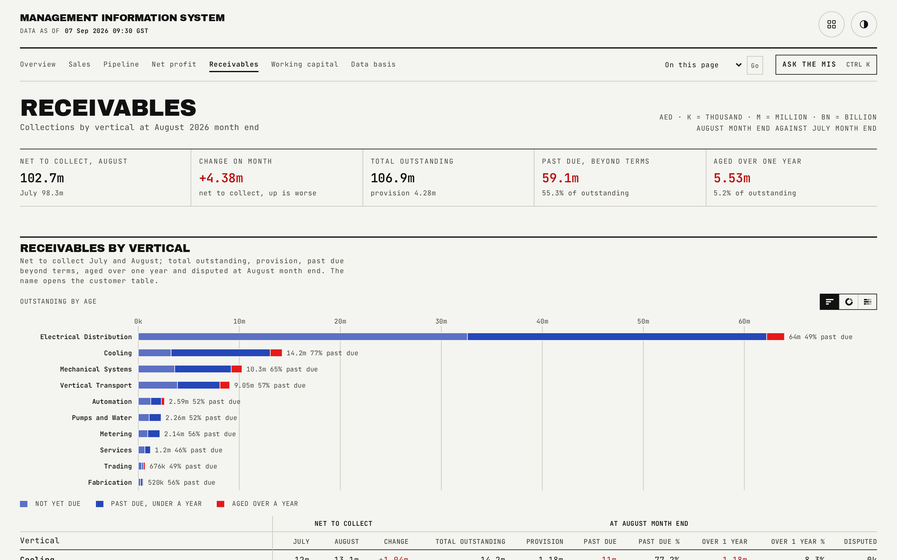

# Receivables

The division-wide receivables position: net-to-collect trend, past due, aging, and why balances are not collected.

## What is on the page

- A five-figure strip: net to collect this month (with last month named beside it), the change on month (treated as a negative outcome when it rises), total outstanding, past due, and aged over one year.
- **Receivables by vertical**: net to collect prior and current month plus the change, and at month end, total outstanding, provision, past due (amount and percent) and aged over one year (amount and percent), plus disputed, sorted descending by current net to collect.
- **Reasons for non-collection**: the division's largest balances under each of three reasons (internal group companies, follow-up with no response, disputes and not yet due), each naming the customer, engineer, vertical, amount, whether it is past due, and the remark.
- **Reasons by vertical**: every vertical's total outstanding split across the same three reasons, plus each vertical's single largest balance.

## How the figures are built

Each customer balance is modelled as invoices carrying an age and that customer's own payment terms. Past due is age beyond terms; the aging buckets are age since invoice regardless of terms, so a balance can sit in a mid-range aging bucket while still being within terms. Net to collect is total outstanding less the provision, the balance the business still expects to collect, not a dated cash forecast. Every balance carries exactly one reason, derived from one underlying state so the dispute flag, the reason and the remark can never disagree, and the three reasons always sum to total outstanding. The provision itself is half of the balance aged one to two years, all of the balance aged over two years, and a quarter of a disputed balance aged 91 to 365 days.

## Interactions

Customer and vertical names throughout this page link onward: a vertical name opens that vertical's customer table, and a customer name opens the engineer who owns that balance.

## See also

- [README](../README.md) for the full page index.
- [docs/08-customer-aging.md](08-customer-aging.md) for the full customer-level table behind this page.
- [docs/07-vertical-detail.md](07-vertical-detail.md) for one vertical's own receivables block.
- [docs/06-working-capital.md](06-working-capital.md) for how receivables feed the total working-capital figure.
