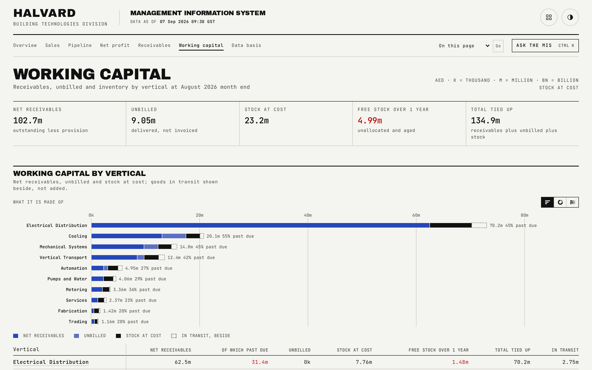
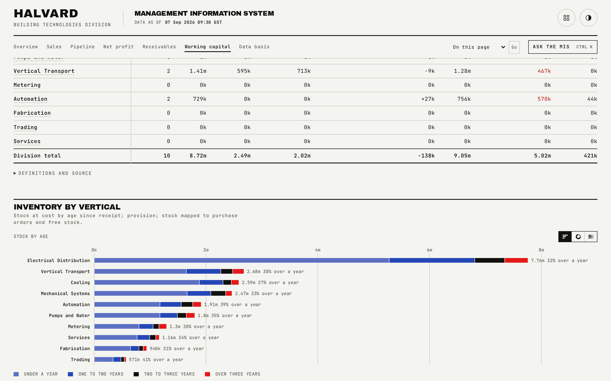

# Working capital

Where working capital is tied up across receivables, unbilled work and inventory, by vertical.

## What is on the page

- A five-figure strip: net receivables, unbilled, stock at cost, free stock over one year (treated as a negative outcome), and total tied up.
- **Working capital by vertical**: net receivables, of which past due, unbilled, stock at cost, free stock over one year, total tied up, and in-transit stock, sorted descending by total.
- **Unbilled by vertical**: each vertical's month bridge (previous month, plus new projects, less cleared projects, plus or minus ongoing changes, current month), project count, the amount aged over 60 days, and the provision.
- **Inventory by vertical**: stock by age (total, under one year, one to two, two to three, over three years), risk (non-moving, provision), and allocation (mapped to purchase orders, mapped and over one year, free stock, free and over one year), plus in-transit stock.

## How the figures are built

Every vertical's unbilled month bridge must reconcile exactly, previous month plus new projects less cleared projects plus ongoing changes equals the current month, and the generator refuses to write output if a single vertical's bridge does not balance. Unbilled aging is reported in eight bands from 60 days or under out past 730 days. Stock is reported in four age bands, and free stock is total stock less whatever is mapped to a purchase order; the provision is half of stock aged two to three years plus all stock aged over three years.

## Interactions

Vertical names in the unbilled and inventory tables link to that vertical's own unbilled or inventory block, so a reader can move from the division roll-up straight to the underlying detail.

## See also

- [README](../README.md) for the full page index.
- [docs/07-vertical-detail.md](07-vertical-detail.md) for one vertical's unbilled projects and inventory blocks in full.
- [docs/05-receivables.md](05-receivables.md) for the receivables half of working capital.
