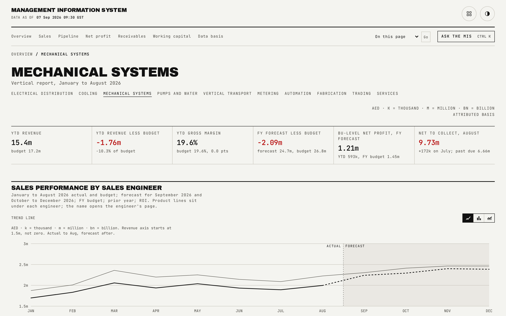

# Vertical detail

One vertical's full sheet, the largest and most detailed page template in the app, reused by every vertical in the multi-vertical organisation. Six blocks, plus a seventh for the one vertical that runs a factory.

## What is on the page

- A six-figure strip: YTD revenue, YTD revenue less budget, YTD gross margin percent, full-year forecast less budget, BU-level net profit forecast, and net to collect.
- **Sales performance by sales engineer**: a monthly revenue chart, then a table with one bold row per engineer (name linking to their own page, tagged if their home vertical differs from this one) followed by that engineer's product-line sub-rows, each tagged when a line is also shown on another vertical's sheet. A disclosure beneath lists every sub-total by product line for the whole sheet.
- **Profit and loss**: this vertical's own ladder, the same rung structure as the division-level page.
- **Business targets by product line**: full-year target, an aspirational stretch figure, achieved year to date, budget to date, the variance, and a progress bar against the full-year target.
- **Inventory outlook**: stock by age, risk and allocation by product line, plus a small table of stock currently in transit with expected arrival dates.
- **Unbilled projects**: a wide table (project, engineer, customer, three trailing months of balance, eight age bands, provision and remarks) followed by the five-step month bridge.
- **Production** (Fabrication vertical only): quantity delivered, invoiced value, material and labour cost by month.
- **Receivables by engineer**: aging buckets, balances, net to collect, and disputed, by engineer, with a link through to the full customer-level table and this vertical's reasons breakdown.

## How the figures are built

A vertical's sheet total covers every row shown on the sheet, including product lines sold by engineers whose home vertical is elsewhere; its attributed total covers only that vertical's own engineers. Every division-level summary uses attributed figures, which is why a vertical's sheet and attributed totals can differ, and the page explains this whenever they do. The target's achievement is measured against budget to date, the annual target phased by month and summed for the elapsed months only, never against the undiluted full-year target.

## Interactions

The engineer-and-product table opens a keyboard-accessible disclosure showing every product-line sub-total across the whole sheet. Vertical names in the header row navigate between every vertical without leaving this page template.

## See also

- [README](../README.md) for the full page index.
- [docs/08-customer-aging.md](08-customer-aging.md) for this vertical's full customer-level receivables table.
- [docs/09-engineer.md](09-engineer.md) for one engineer's own version of several of these blocks.
- [docs/02-sales.md](02-sales.md) for how this vertical's sales figures roll up to the division.
