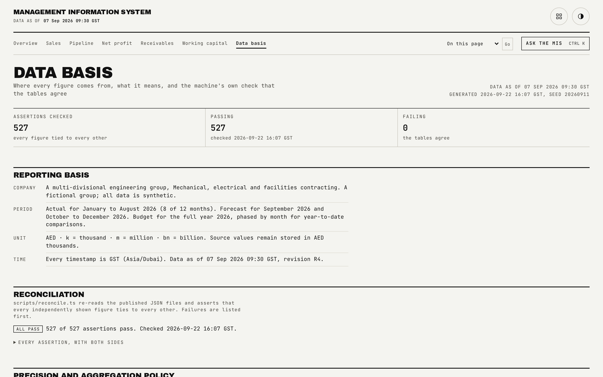

# Data basis

The transparency page: where every figure comes from, what every term means, the generator's own precision policy, the machine-run reconciliation result, and the list of synthetic assumptions.

## What is on the page

- **Reporting basis**: company, period, unit and time facts.
- **Reconciliation**: a pass or fail summary line, the count of assertions passed, and the checked-at timestamp, with every individual assertion available in a disclosure (failed assertions, if any, sorted first).
- **Precision and aggregation policy**: the policy statements rendered verbatim from the data, not restated by the page.
- **Netting**: the same netting explanation and figures shown on the sales page, linked back to the full disclosure there.
- **Definitions**: every defined term in the dataset, as a term and text pair.
- **Sources**: every named data source.
- **Synthetic assumptions**: the list of assumptions the generator made to produce a coherent business.

## How the figures are built

This is the only page in the app that reads two data files independently: the division roll-up for definitions, sources, the precision policy, assumptions and the netting figures, and `reconciliation.json`, the output of `bun run reconcile`, for the assertion result. The two have independent loading and error states, so a problem with one never blocks the other from rendering. The reconciliation shown here is 527 assertions, organised across the whole dataset: division level, vertical level, and one assertion per customer's aging buckets and per unbilled project's age bands, which is why the count scales with the size of the dataset.

## Interactions

The full assertion list opens as a disclosure, automatically expanded if any assertion has failed, so a failure is never one click away from being missed.

## See also

- [README](../README.md) for the full page index and the quality-gate command table.
- [docs/data-model.md](data-model.md) for the schema every one of these figures is validated against.
- [docs/quality-gates.md](quality-gates.md) for how the 527-assertion reconciliation and every other gate are run.
